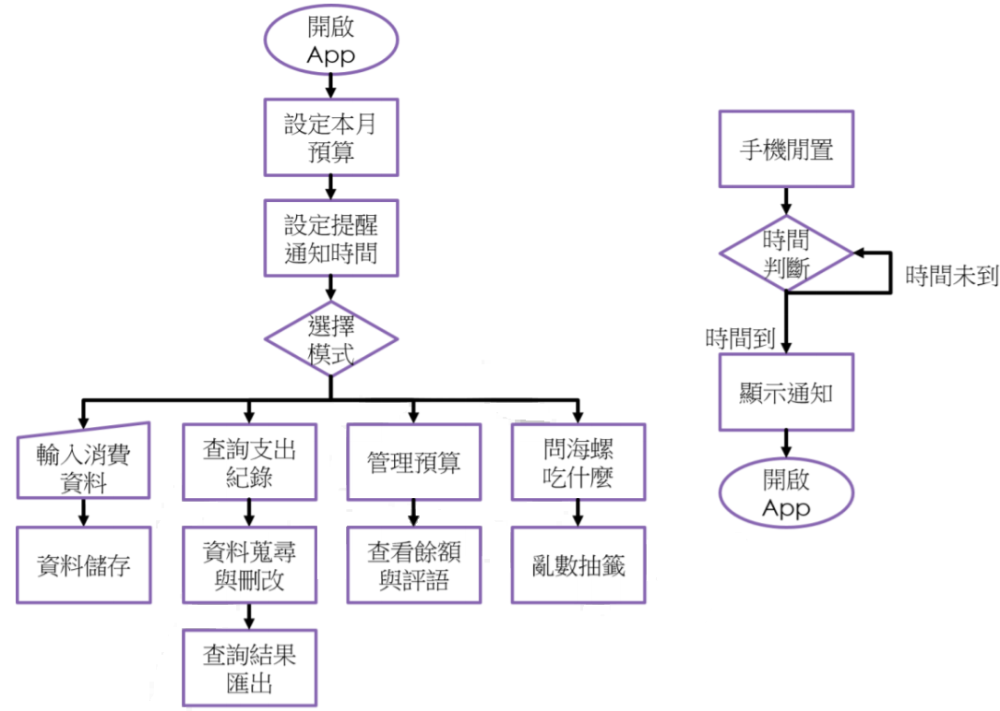

# 呷飯皇帝大(JiaBen)

- 以記帳簿為發想，鎖定學生的主要開銷【食】，兼具記帳及紀錄飲食習慣的功能
- 開發語言: Android
- 開發平台: Android Studio
- 應用: `TabHost`, `SQLite`, `Notification`
- 功能簡報: https://hackmd.io/@RMR6xkGdREOIMup5u-mJ8A/Bkqe1VW58?type=slide#/

系統流程圖
---

App統計畫面
---
  

問問神奇海螺
---
  
